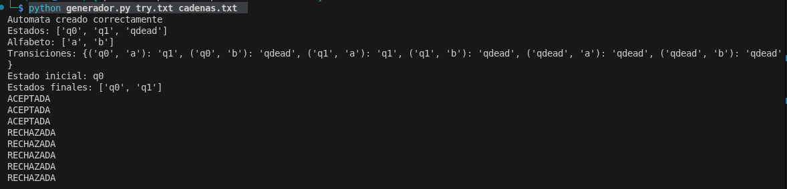

# Generador y comprobador de automatas mediante txt
---
Un Automata Finito Determinista (AFD) es una tupla de 5 elementos que se define como:
M = (Q, Σ, q₀, δ, F)
Donde:
* Q: Representa el conjunto de estados que hay en el AFD
* Σ: El alfabeto finito (simbolos de entrada)
* q₀: El estado inicial
* δ: Son las funciones de transiciones donde toma un estado y un símbolo de entrada y devuelve exactamente un estado siguiente
* F: Conjunto de estados finales o estados de aceptacion

## Funcionamiento
El automata comienza en el estado inicial q₀

Lee una cadena de entrada compuesta por símbolos del alfabeto Σ (por ejemplo, "0101")

Para cada simbolo en la cadena (de izquierda a derecha), la función de transición δ le dice al automata a qué estado debe moverse, basándose en su estado actual y el simbolo que esta leyendo

Despues de procesar el ultimo simbolo de la cadena:

Si el automata termina en un estado que pertenece al conjunto F (estados finales), la cadena es aceptada. Si termina en cualquier otro estado, la cadena es rechazada

## Ejemplo de prueba
Ingresamos la siguiente configuracion para el automata:
```bash
q0,q1,qdead
a,b
(q0:a)=q1,(q0:b)=qdead,(q1:a)=q1,(q1:b)=qdead,(qdead:a)=qdead,(qdead:b)=qdead
q0
q0,q1
```

Para efectos de organizacion, decidi establecer que la **primera linea** del archivo sean los estados que hay en el automata, la **segunda linea** es el alfabeto que acepta (caracteres), la **tercera linea** contiene las transiciones entre estados, la **cuarta linea** es el estado inicial y la ultima linea son los estados finales.

## Integracion del automata con caracteres

```bash
a
aa
aaa
b
ab
ba
aab
aaaba
```
## Ejecucion del prorgrama

```bash
python generador.py try.txt cadenas.txt
```
## Imagen de pruebas
